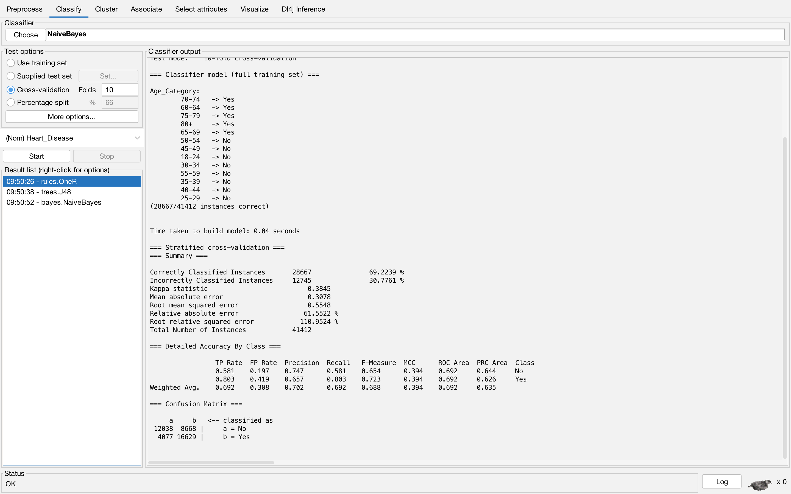
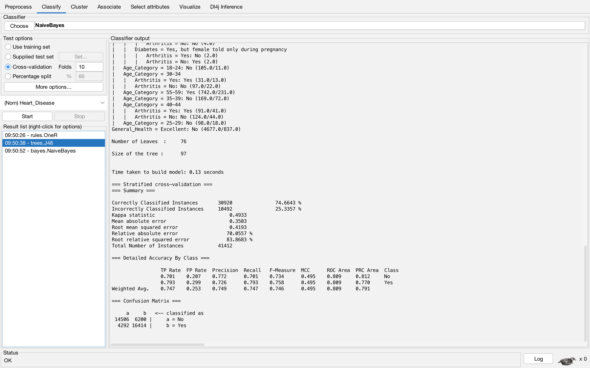
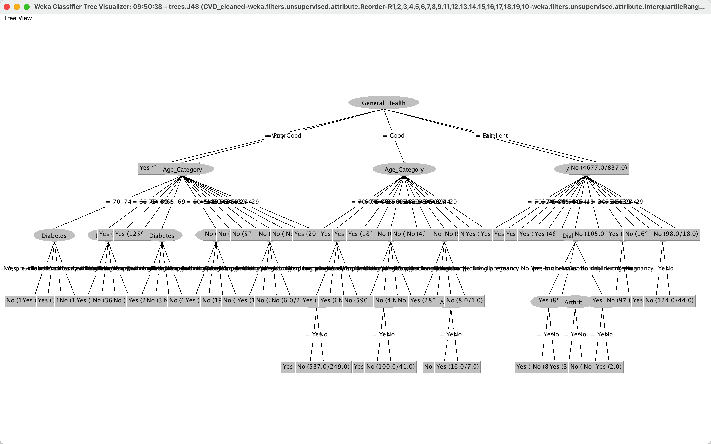

# Assignment 1
> data: [Cardiovascular Diseases Risk Prediction Dataset](https://www.kaggle.com/datasets/alphiree/cardiovascular-diseases-risk-prediction-dataset?resource=download)

## Notes 
### Data mining process model (lecture 1.3)
- PDCA (plan, do, check, action)
- CRISP-DM (cross industry standard protocol for data mining)

    

### Key Steps
1. What is the business goal(objective)?
2. Collation of data 
    - Data visualization
    - Data collection, preprocessing, reduction and transformation
3. Model selection
    - Classification / regression / ARM / Clustering, etc.
    - Evaluate model -> interesting insights / knowledge?
4. Actionable insights
    - Present insights
    - Return on investments (ROI)
    - Fine-tune model with new data

## Steps
### Data Preprocessing
#### 1. Select Class Attribute
The dataset we have is of decent quality overall. All attributes have 0% missing variables.

However, upon opening the CSV file, we found that the data is not structured in an optimal way for our analysis. Specifically, Weka automatically taking the last attribute as the class attribute, but for better visualization and understanding of this dataset, we wanted to manually set 'sex' as the class attribute instead. 

    

`Edit` $\rightarrow$ right click on `sex` $\rightarrow$ select `Attribute as class`

    

By setting 'sex' as the class attribute, we are able to get more comprehensive visualization and insights from the dataset regarding how Cardiovascular diseases are distributed across genders.

#### 2. Use IQR to remove outliers and extreme values
 `preprocess` $\rightarrow$ `filter` $\rightarrow$ `filters/unsupervised/attribute/interquartileRange` $\rightarrow$ `apply`

Outliers (258141 vs 50713):

    

Extreme Values (306318 vs 2536):

    

 `preprocess` $\rightarrow$ `filter` $\rightarrow$ `filters/unsupervised/instance/removeWithValues` $\rightarrow$ `apply`

After removing outlier and extreme value data points, the total number of instances in our dataset decreased from 308854 to 256396. The removal of these distort data points helped optimize the  skewness of attributes such as `weight`.

Weight before adjustment:

    

Weight after adjustment:

    

#### More preprocessing ideas to explore
- numeric transformation
- normalize data
- resample instance

### Clustering
Significant portion of our attributes(have or don't have heart disease) are nominal data, clustering does not apply to them.

Clustering algorithms such as k-means work best with numerical data.

#### K-Means clustering
Using clustering analysis, we observed the following: individuals in the top 50th percentile (>64) for green vegetable intake demonstrated less likelihood of hearth disease compared to those with lower green vegetable consumption.

    

### Classification
- Preprocessing
    - remove unwanted attributes
    - discretize 7 attributes(height, weight, BMI, alcohol/fruit/greenVege/friedPotato consumption) into 8 bins
#### One R
Result:

    

#### J48 Decision Tree
Result:

    

Tree visualization:

    

